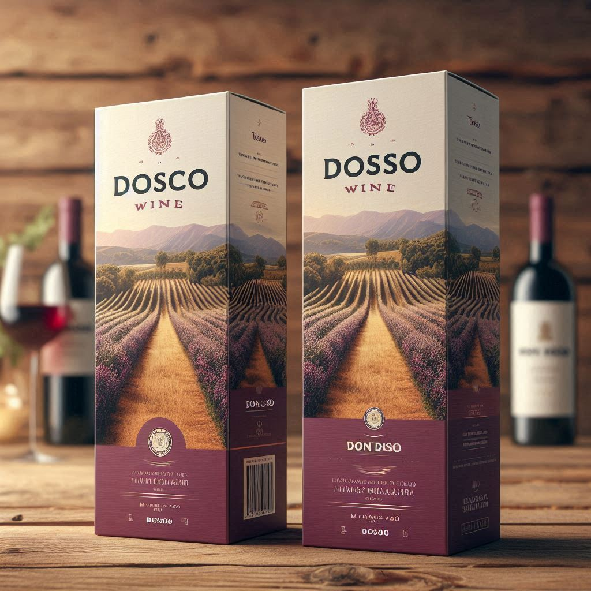

<html lang="es">
<head>
    <meta charset="UTF-8">
    <meta name="viewport" content="width=device-width, initial-scale=1.0">
    <title>Viñedos Don Dosco</title>
    <link rel="stylesheet" href="styles.css">
    
</head>
<body>

    <header>
        <h1>Viñedos Don Dosco</h1>
        
La esencia de los mejores vinos de Argentina

    </header>

    

        

            
        

        

            
        

        

            
        

        

            <button class="nav-button" onclick="moveSlide(-1)">❮</button>
            <button class="nav-button" onclick="moveSlide(1)">❯</button>
        

    

    <section id="catalogo" class="catalogo">
        <h2>Catálogo de Vinos</h2>
        

            
            <h3>Malbec</h3>
            
Vino tinto con notas de frutas rojas y un toque de roble.

            <button onclick="agregarAlCarrito('Malbec')">Agregar al Carrito</button>
        

        

            
            <h3>Cabernet Sauvignon</h3>
            
Un vino robusto con sabores intensos y un final suave.

            <button onclick="agregarAlCarrito('Cabernet Sauvignon')">Agregar al Carrito</button>
        

        

            
            <h3>Syrah</h3>
            
Vino con aroma de especias y un cuerpo elegante.

            <button onclick="agregarAlCarrito('Syrah')">Agregar al Carrito</button>
        

    </section>

    <section id="promociones" class="promociones">
        <h2>Promociones</h2>
        

            
            <h3>30% de Descuento en Malbec</h3>
            
Solo por tiempo limitado.

        

        

            
            <h3>2x1 en Cabernet Sauvignon</h3>
            
Aprovecha nuestra oferta especial.

        

        

            
            <h3>Descuento del 20% en la primera compra</h3>
            
Únete a nuestra familia de vinos.

        

    </section>

    <section id="testimonios" class="testimonios">
        <h2>Testimonios de Nuestros Clientes</h2>
        

            
"El mejor vino que he probado, definitivamente volveré por más!" - Juan P.

        

        

            
"Una experiencia increíble, el servicio es excelente." - Ana R.

        

        

            
"Me encantó el sabor y la calidad. ¡Altamente recomendado!" - Luis M.

        

    </section>

    

        🛒
    

    

        <h3>Productos en el Carrito</h3>
        
No hay productos en el carrito.

    

    <section id="contacto" class="contacto">
        <h2>Contacto</h2>
        
Para más información, contáctanos en: <a href="mailto:info@donbosco.com">familiadondosco@gmail.com</a>

    </section>

    
</body>
</html>
